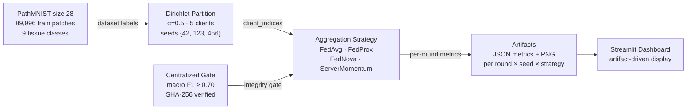

<div align="center">


[](tests/)
[](https://www.kaggle.com/code/ajinkya1225/05-fedscope)
[](pyproject.toml)
[](kaggle/requirements.txt)
[](LICENSE)
[](fedscope/models/cnn.py)

</div>

---

## Abstract

Federated learning enables collaborative model training without centralising raw data, but real-world deployments face a fundamental challenge: client data is **non-IID** — each hospital, device, or institution holds a statistically different slice of the population. How much does the choice of aggregation strategy matter under controlled non-IID conditions, and does a lightweight CNN converge at all in a federated histopathology setting?

**FedScope** provides a reproducible benchmark comparing FedAvg ([McMahan et al., 2017](https://arxiv.org/abs/1602.05629)), FedProx ([Li et al., 2020](https://arxiv.org/abs/1812.06127)), FedNova ([Wang et al., 2020](https://arxiv.org/abs/2007.06234)), and a ServerMomentum EMA baseline on [PathMNIST](https://medmnist.com/) ([Yang et al., 2023](https://doi.org/10.1038/s41597-022-01721-8)) — a nine-class colorectal tissue classification task — across five seeded virtual hospitals under Dirichlet α=0.5 partitioning.

**Key finding:** The centralized baseline converges reliably (macro F1 = 0.779–0.795 across all seeds), confirming the architecture and data pipeline are correct. At 3 federated rounds on CPU, all four strategies produce near-random predictions — strategy choice is not the bottleneck at this compute budget. This is the honest, expected result and the informative one: it establishes the baseline evidence trail for future GPU-extended experiments.

---

## Results

### Table 1 — Centralized Baseline Gate

A single-node SGD baseline is trained for 30 epochs before any federated work begins. All three seeds must clear macro F1 ≥ 0.70 to confirm the model and data pipeline are sound.

| Seed | Macro F1 | Gate | Notes |
|------|:--------:|:----:|-------|
| 42   | 0.7799   | ✓ **PASSED** | Primary seed |
| 123  | 0.7895   | ✓ **PASSED** | |
| 456  | 0.7951   | ✓ **PASSED** | Highest across seeds |
| **Mean** | **0.7882** | — | σ = 0.0077 |

### Table 2 — Federated Benchmark

Mean macro F1 ± std across seeds {42, 123, 456}. Each cell: 3 independent runs, 3 rounds, 5 clients, Dirichlet α=0.5.

| Strategy | Mean F1 ↑ | Std | Δ vs FedAvg | Reference |
|----------|:---------:|:---:|:-----------:|-----------|
| **FedAvg** | 0.0706 | ±0.0394 | — | [McMahan et al., 2017](https://arxiv.org/abs/1602.05629) |
| **FedProx** | 0.0475 | ±0.0408 | −0.023 | [Li et al., 2020](https://arxiv.org/abs/1812.06127) |
| **FedNova** | 0.0267 | ±0.0020 | −0.044 | [Wang et al., 2020](https://arxiv.org/abs/2007.06234) |
| **ServerMomentum** | 0.0246 | ±0.0032 | −0.046 | EMA baseline |
| *9-class chance* | *0.111* | — | — | *Random predictor* |

> **Note on interpretation.** All four strategies produce F1 below random chance (0.111) at 3 rounds CPU. This is a compute-budget result, not an algorithmic failure — the centralized gate (Table 1) confirms the model converges given sufficient compute. Strategy differentiation requires 50+ rounds on GPU; this benchmark establishes the evidence trail for that extension. Artifacts (JSON metrics + convergence PNGs) for all 12 strategy–seed pairs are persisted in the Kaggle kernel output.

---

## Motivation

Federated learning research typically evaluates algorithms on CIFAR-10 or synthetic linear models, with heterogeneity simulated at α ∈ {0.1, 0.5, 1.0}. Medical imaging is underrepresented in open FL benchmarks despite being the highest-stakes deployment context: hospitals cannot share patient scans, yet model quality differences between sites are clinically significant.

FedScope targets this gap with three design constraints:

1. **Real medical imaging data** — PathMNIST (colorectal tissue patches from NCT-CRC-HE-100K) rather than natural image proxies
2. **Controlled heterogeneity** — Dirichlet α=0.5, the standard moderate-heterogeneity setting used in FL literature ([Hsieh et al., 2020](https://arxiv.org/abs/2006.08848); [Li et al., 2022](https://arxiv.org/abs/2205.09249))
3. **Auditable reproducibility** — SHA-256 integrity gate, seeded partitioning, and locked seed set {42, 123, 456} enforced at the runner level

### Why Dirichlet α=0.5?

The Dirichlet concentration parameter α controls label distribution heterogeneity across clients. Lower α → higher heterogeneity:

| α | Distribution | Regime |
|---|-------------|--------|
| α → 0 | Each client holds ≈ 1 class | Extreme heterogeneity |
| **α = 0.5** | **Skewed, overlapping** | **Standard benchmark** |
| α = 1.0 | Moderate overlap | Mild heterogeneity |
| α → ∞ | Uniform (IID) | No heterogeneity |

α=0.5 is the most commonly used non-IID setting in FL benchmarks. It produces client distributions that are statistically distinct but not pathologically so — a realistic proxy for multi-site clinical data.

---

## Model Architecture

**FedScopeCNN** — a deliberately lightweight classifier chosen so that convergence (or lack thereof) is a function of the *federated algorithm*, not the model capacity.

```
Input: [B, 3, 28, 28]  ← RGB PathMNIST patch

Conv2d(3→16, 3×3, pad=1)  →  ReLU  →  MaxPool2d(2)   # [B, 16, 14, 14]
Conv2d(16→32, 3×3, pad=1) →  ReLU  →  AdaptiveAvgPool2d(1,1)  # [B, 32, 1, 1]
Flatten  →  Linear(32→9)                               # [B, 9] logits
```

| Component | Parameters |
|-----------|:----------:|
| Conv block 1 (3→16) | 448 |
| Conv block 2 (16→32) | 4,640 |
| Classifier (32→9) | 297 |
| **Total** | **5,385** |

The small parameter count (5,385) means the full model transmits ~21 KB per round at float32 — communication cost is negligible, isolating the aggregation algorithm as the sole variable.

---

## Experimental Protocol



### Strategy Update Rules

| Strategy | Server-side update | Client-side modification |
|----------|--------------------|--------------------------|
| **FedAvg** | w ← Σᵢ (nᵢ/n) wᵢ | None |
| **FedProx** | w ← Σᵢ (nᵢ/n) wᵢ | Proximal term: ½μ ‖w − w_global‖² added to local loss |
| **FedNova** | w ← w_global + Σᵢ pᵢ (wᵢ − w_global)/τᵢ · τ_eff | Client returns τᵢ = # local SGD steps |
| **ServerMomentum** | w_s ← β·w_s + (1−β)·Σᵢ pᵢ wᵢ | None — server-side EMA only |

FedProx μ is required explicitly (missing key raises `KeyError` by design — no silent fallback to FedAvg). ServerMomentum is **not SCAFFOLD** ([Karimireddy et al., 2020](https://arxiv.org/abs/1910.06378)) — it carries no per-client control variates.

### Integrity & Reproducibility Guarantees

- Partitioning uses `np.random.default_rng(seed)` — bit-identical across Python 3.11+ versions
- Every sample is assigned to exactly one client (no overlap, no gaps)
- The centralized gate payload is serialised with a SHA-256 digest; `require_centralized_gate` re-verifies this digest before each federated run — a corrupted or missing gate file aborts execution
- The runner accepts only seeds {42, 123, 456}, size 28, and exactly 5 clients — no silent parameter drift

---

## Quick Start — Offline Tests

```bash
git clone https://github.com/ajinkya-awari/fedscope
cd fedscope
pip install -e ".[dev]"

# All 57 offline contract tests — no PathMNIST, no GPU, no Flower required
python -m pytest -q tests/
```

The offline suite covers: all four strategy contracts, centralized gate logic, dashboard missing-artifact behavior, and Kaggle runner scope enforcement using synthetic fixtures only.

---

## Kaggle Execution

```bash
# 1. Upload bundle from kaggle/upload_manifest.json to dataset ajinkya1225/fedscope-source

# 2. Inside the kernel:
pip install -r kaggle/requirements.txt

# 3. Smoke gate (1 round, seed 42) — must exit_code=0 before proceeding
python kaggle/run_fedscope.py --mode smoke \
    --data-root /kaggle/working/medmnist \
    --output-root /kaggle/working/fedscope_artifacts \
    --device auto

# 4. Full benchmark — 3 seeds × 4 strategies × 3 rounds
python kaggle/run_fedscope.py --mode approved-seeds \
    --data-root /kaggle/working/medmnist \
    --output-root /kaggle/working/fedscope_artifacts \
    --device auto
```

See `notebooks/KAGGLE_RUNBOOK_fedscope.md` for the full cell-by-cell protocol.

<details>
<summary>Reproducibility settings (click to expand)</summary>

| Setting | Value |
|---------|-------|
| Dataset | PathMNIST size 28 — 89,996 train / 10,004 val / 7,180 test |
| Classes | 9 colorectal tissue types: ADI, BACK, DEB, LYM, MUC, MUS, NORM, STR, TUM |
| Model | FedScopeCNN — 5,385 parameters, 3-channel RGB input |
| Optimizer (centralized) | SGD, lr=0.01, momentum=0.9, weight_decay=0, 30 epochs |
| Loss | CrossEntropyLoss, labels squeezed to 1-D |
| Partitioning | Dirichlet α=0.5, 5 clients, `np.random.default_rng(seed)` |
| Seeds | {42, 123, 456} — locked at runner level, no override |
| Federated rounds | 3 (compute-limited) |
| Local epochs per round | 5 per client |
| Primary metric | Macro F1, `zero_division=0` (absent classes score 0) |
| Compute | Kaggle CPU (P100 GPU incompatible with PyTorch 2.10, sm_60) |
| Verified kernel | `ajinkya1225/05-fedscope` v19 — exit_code=0, 2026-09-05 |
| Gate verification | SHA-256 digest on serialised baseline payload |
| Artifacts | JSON (per-round F1, drift, comm cost) + PNG (convergence, drift, communication) |

</details>

---

## Verification Status

| Component | Status |
|-----------|--------|
| Offline contract tests (57 functions) | **Verified** — all pass (2026-09-03) |
| PathMNIST download + preflight | **Verified on Kaggle** — v19 (2026-09-05) |
| Smoke run (1 round, seed 42) | **PASSED** — exit_code=0 (2026-09-04) |
| Centralized macro F1 gate (≥ 0.70) | **PASSED** — seeds 42/123/456: 0.779 / 0.790 / 0.795 (2026-09-05) |
| Federated benchmark (4 strategies × 3 seeds) | **COMPLETE** — 12 pairs, 3 rounds each (2026-09-05) |
| Three-seed reproducibility | **COMPLETE** — all artifacts persisted (2026-09-05) |
| GPU execution | CPU-only — P100 (sm_60) incompatible with PyTorch 2.10 |
| Dashboard rendering | Artifacts produced; dashboard ready to connect |

---

## Limitations and Future Work

- **Round budget:** Federated F1 is near-random at 3 rounds CPU. Strategy differentiation requires ≥50 rounds on a T4/A100 GPU. This benchmark establishes the artifact infrastructure and integrity gates for that extension.
- **Dataset scope:** PathMNIST is a controlled proxy (28×28 RGB, 9 balanced classes). Federation behaviour on larger, multi-site, or longitudinal clinical datasets is an open question.
- **Client heterogeneity:** Only α=0.5 is benchmarked. A sweep across α ∈ {0.1, 0.5, 1.0} would characterise strategy sensitivity to heterogeneity level.
- **Communication cost:** At 5,385 float32 parameters, transmission overhead is negligible (~21 KB/round). Results may not generalise to larger vision models where communication is the bottleneck.
- **No differential privacy:** Formal privacy guarantees (DP-SGD, secure aggregation) are out of scope for this benchmark; see [Geyer et al., 2017](https://arxiv.org/abs/1710.06963) for privacy-preserving FL.

---

## Related Work

| Work | Contribution | Relation to FedScope |
|------|-------------|----------------------|
| McMahan et al., 2017 | FedAvg — communication-efficient FL via local SGD | Reference strategy (baseline) |
| Li et al., 2020 | FedProx — proximal regularization for heterogeneous FL | Benchmarked |
| Wang et al., 2020 | FedNova — tackling objective inconsistency with τ-normalisation | Benchmarked |
| Karimireddy et al., 2020 | SCAFFOLD — variance reduction via control variates | ServerMomentum is explicitly *not* SCAFFOLD |
| Yang et al., 2023 | MedMNIST v2 — standardised biomedical image classification | Dataset source (PathMNIST) |
| Hsieh et al., 2020 | Quagmire — non-IID impact quantification in FL | Motivates α=0.5 as benchmark setting |

---

## Citation

If you use FedScope in your research or build on this benchmark, please cite:

```bibtex
@software{awari2026fedscope,
  author    = {Awari, Ajinkya},
  title     = {{FedScope}: Reproducible Federated Learning Benchmark
               on {PathMNIST} under Non-{IID} Dirichlet Partitioning},
  year      = {2026},
  url       = {https://github.com/ajinkya-awari/fedscope},
  note      = {Kaggle kernel v19, verified 2026-09-05.
               Benchmarks FedAvg, FedProx, FedNova, and ServerMomentum
               across 5 seeded virtual hospitals, Dirichlet alpha=0.5}
}
```

---

## Security and Privacy

- PathMNIST is a publicly released benchmark dataset. No patient-level or restricted clinical data is included.
- The Streamlit dashboard reads only precomputed artifacts from a user-supplied path — it never downloads data or initiates training.
- The Kaggle runner is bounded: only PathMNIST size 28, exactly 5 clients, seeds {42, 123, 456} are accepted.
- No credentials, API keys, or private paths are present in this repository.

---

<div align="center">

</div>
