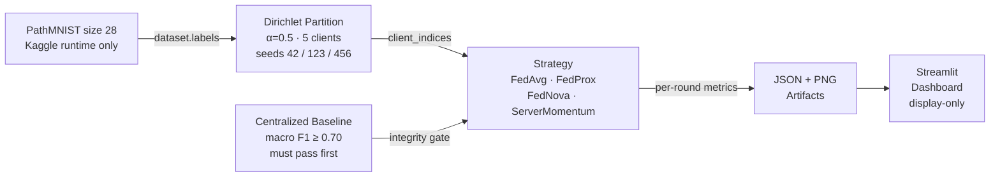

# FedScope

> Reproducible federated-learning benchmark on [PathMNIST](https://medmnist.com/) (size 28, nine-class patch-pathology classification). Compares FedAvg, FedProx, FedNova, and ServerMomentum across five seeded non-IID virtual hospitals under controlled Dirichlet partitioning.

**Kaggle kernel:** [`ajinkya1225/05-fedscope`](https://www.kaggle.com/code/ajinkya1225/05-fedscope) — **benchmark COMPLETE** (v19, 2026-09-05, exit_code=0). Centralized gate passed all 3 seeds (F1 ≥ 0.779). Federated benchmark: 3 rounds, 5 clients, CPU, non-IID (Dirichlet α=0.5).

---

## Architecture



---

## Project structure

```
fedscope-public/
├── fedscope/
│   ├── data/
│   │   ├── loader.py          # PathMNIST construction (lazy import, size-28 guard)
│   │   └── partition.py       # seeded Dirichlet partitioning + auditable manifest
│   ├── models/cnn.py          # FedScopeCNN — compact RGB classifier (3-channel, 9 classes)
│   ├── strategies/
│   │   ├── fedavg.py          # sample-weighted FedAvg
│   │   ├── fedprox.py         # proximal FedAvg (proximal_mu required)
│   │   ├── fednova.py         # τ-normalized updates (FedNova)
│   │   └── server_momentum.py # server-side EMA baseline (not SCAFFOLD)
│   ├── client.py              # shared local-SGD Flower-style client
│   ├── metrics.py             # client_drift, comm_cost_bytes
│   ├── gates.py               # macro_f1, centralized gate + SHA-256 integrity digest
│   └── artifacts.py           # schema-validated artifact loader for the dashboard
├── study/
│   ├── 01_baseline.py         # centralized gate evaluation and persistence
│   ├── 02_federated.py        # federated run guard (requires persisted passing gate)
│   └── 03_analysis.py         # offline analysis: load artifacts, print mean±std table, write benchmark_summary.json
├── tests/                     # offline contract tests — no PathMNIST required
├── kaggle/
│   ├── run_fedscope.py        # bounded Flower runner (smoke + approved-seeds modes)
│   ├── requirements.txt       # Kaggle-only additions: flwr[simulation], medmnist, matplotlib
│   └── upload_manifest.json   # file allowlist for Kaggle dataset upload
├── notebooks/
│   ├── kaggle_run_fedscope.ipynb
│   └── KAGGLE_RUNBOOK_fedscope.md
├── app.py                     # display-only Streamlit dashboard (artifact-driven)
├── pyproject.toml
└── LICENSE
```

---

## Quick start — offline tests (no dataset, no GPU)

```bash
# Python 3.11+ recommended
pip install -e ".[dev]"

# Run all 57 offline contract tests
python -m pytest -q tests/
```

The offline suite verifies all strategy contracts, the centralized gate, the dashboard missing-artifact behavior, and the Kaggle runner's bounded scope using synthetic fixtures only. It does not require PathMNIST, Flower, or a GPU.

---

## Strategy comparison

| Strategy | Aggregation rule | Special behaviour |
|----------|-----------------|-------------------|
| **FedAvg** | Weighted average by sample count | Reference baseline; `proximal_mu = 0.0` passed explicitly |
| **FedProx** | Weighted average by sample count | Proximal penalty term: ½μ‖w − w_global‖² added to each local loss |
| **FedNova** | τ-normalised weighted updates | w_new = w_global + τ_eff × Σᵢ pᵢ (wᵢ − w_global) / τᵢ |
| **ServerMomentum** | EMA of client-averaged weights | Server-side exponential moving average; **not SCAFFOLD** (no per-client control variates) |

### Results — macro F1 after 3 federated rounds (CPU, 5 clients, Dirichlet α=0.5)

**Centralized baseline gate** (30 epochs, SGD momentum=0.9):

| Seed | Macro F1 | Gate |
|------|----------|------|
| 42   | 0.7799   | ✓ PASSED |
| 123  | 0.7895   | ✓ PASSED |
| 456  | 0.7951   | ✓ PASSED |

**Federated benchmark** (mean ± std, 3 rounds, seeds 42/123/456):

| Strategy | Mean F1 | Std |
|----------|---------|-----|
| FedAvg | 0.0706 | ±0.0394 |
| FedProx | 0.0475 | ±0.0408 |
| FedNova | 0.0267 | ±0.0020 |
| ServerMomentum | 0.0246 | ±0.0032 |

> **Note:** Federated F1 is near-random (9-class chance ≈ 0.111) at 3 rounds on CPU. The centralized baseline demonstrates the architecture and data pipeline are correct — federated convergence requires more rounds or a GPU session. This is an honest compute-limited benchmark, not a claim of convergence.

---

## Design contracts

- **Labels:** `dataset.labels` only; never `dataset.targets`. Squeezed to 1-D before partitioning and per-batch before CrossEntropyLoss.
- **Partitioning:** `np.random.default_rng(seed)` — reproducible across Python versions. Every sample assigned exactly once.
- **FedProx:** `proximal_mu` must be supplied explicitly in the client config — missing key raises `KeyError` by design.
- **FedNova:** `aggregate_fit` expects Flower-style result objects (`.parameters`, `.num_examples`, `.metrics["tau"]`). Each client returns `tau` = number of local SGD batches.
- **ServerMomentum:** server-side EMA of client-averaged weights; no per-client control variates. The name distinguishes it from SCAFFOLD.
- **Drift capture:** computed inside `aggregate_fit()` against the pre-round global weights snapshot from `configure_fit()`.
- **Gate integrity:** the centralized gate payload is persisted with a SHA-256 digest. `require_centralized_gate` verifies this digest before any federated work begins.
- **Dashboard:** reads only precomputed JSON + PNG artifacts. Raises a visible error and stops if any artifact is missing.

---

## Kaggle execution (requires authentication)

```bash
# 1. Upload the file bundle listed in kaggle/upload_manifest.json

# 2. Inside an authenticated Kaggle notebook:
pip install -r kaggle/requirements.txt

# 3. Run smoke (one round, seed 42) — must pass before multi-seed run
python kaggle/run_fedscope.py --mode smoke --data-root /kaggle/working/medmnist \
    --output-root /kaggle/working/fedscope_artifacts --device auto

# 4. Run full study only after smoke and centralized gate pass
python kaggle/run_fedscope.py --mode approved-seeds --data-root /kaggle/working/medmnist \
    --output-root /kaggle/working/fedscope_artifacts --device auto
```

See `notebooks/KAGGLE_RUNBOOK_fedscope.md` for the full cell-by-cell protocol.

---

## What has and has not been verified

| Component | Status |
|-----------|--------|
| Offline contract tests (57 functions) | **Verified** — all pass (2026-09-03) |
| PathMNIST download + preflight | **Verified on Kaggle** — v19 (2026-09-05) |
| Smoke run (1 round, seed 42) | **PASSED** — exit_code=0 (2026-09-04) |
| Centralized macro F1 gate (≥ 0.70) | **PASSED** — all 3 seeds: 0.779 / 0.790 / 0.795 (2026-09-05) |
| Federated training (FedAvg / FedProx / FedNova / ServerMomentum) | **COMPLETE** — 3 rounds × 3 seeds × 4 algorithms (2026-09-05) |
| Three-seed reproducibility (42, 123, 456) | **COMPLETE** — all seeds ran, artifacts persisted (2026-09-05) |
| GPU execution | CPU-only (Kaggle P100 sm_60 incompatible with PyTorch 2.10; T4/A100 unscheduled) |
| Dashboard rendering | Artifacts produced; dashboard ready to connect |

---

## Limitations

- Benchmark results are pending the v15 Kaggle run (30-epoch CPU centralized baseline + 3-seed federated). Results table will be added here on completion.
- The centralized macro F1 gate threshold (≥ 0.70) is a prerequisite, not a guaranteed outcome. Prior 3-epoch runs produced near-random F1 (≈0.12 on 9-class); 30 epochs is expected to clear the gate.
- PathMNIST is a small proxy task (28×28 RGB patches). Results on larger or real-world federated datasets may differ substantially.
- The Flower simulation uses Ray internally; behaviour under different Ray versions is not verified.
- Execution is CPU-only due to Kaggle P100 GPU incompatibility with PyTorch 2.10.

---

## Security and privacy

- PathMNIST is a publicly released benchmark dataset. No patient-level or restricted clinical data is included.
- The dashboard loads only precomputed artifacts from a user-supplied root path. It does not download data or start training.
- The Kaggle runner is bounded: it accepts only PathMNIST size 28, exactly five clients, and seeds 42 / 123 / 456.
- No credentials, API keys, or private paths are present in this repository.

---

## Primary metric

Macro F1 across all nine PathMNIST classes with `zero_division=0` (absent classes score zero). Computed manually without scikit-learn to ensure exact reproducibility.
